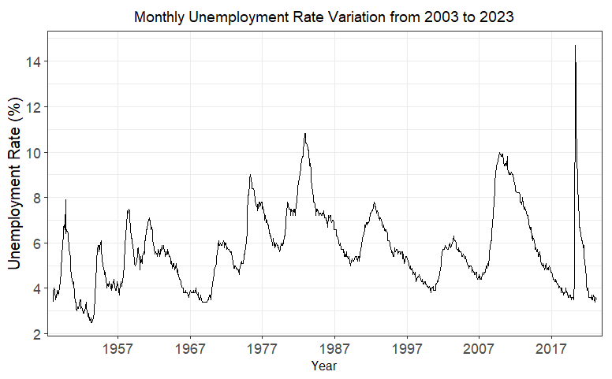
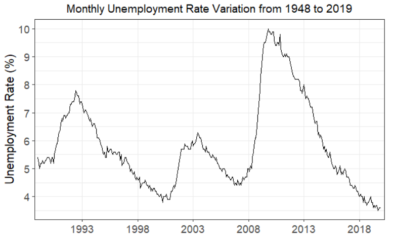
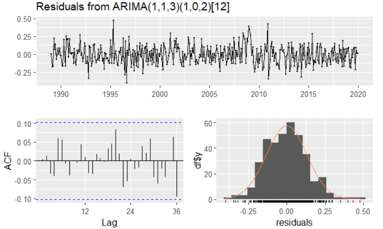
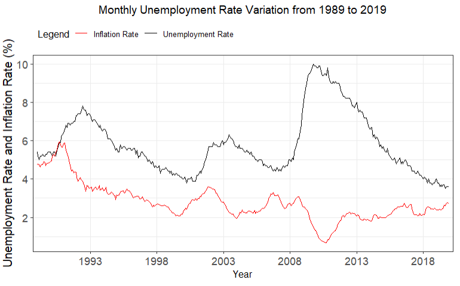
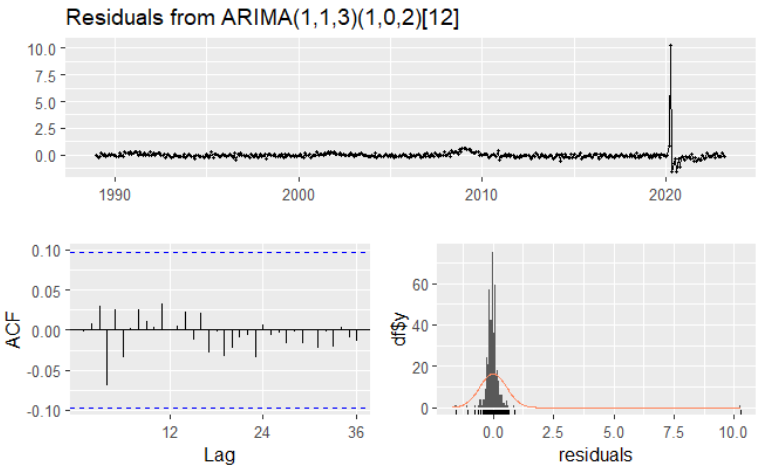
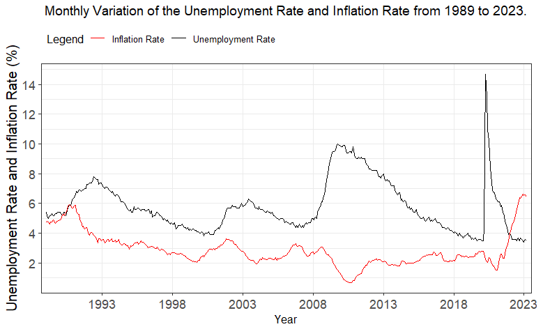
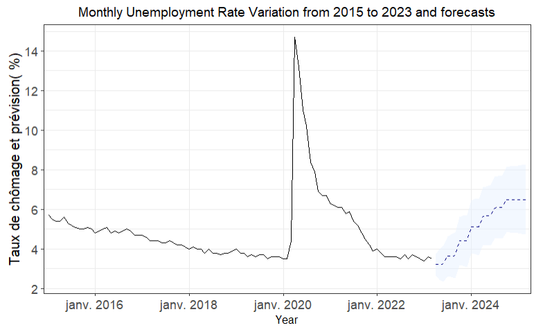
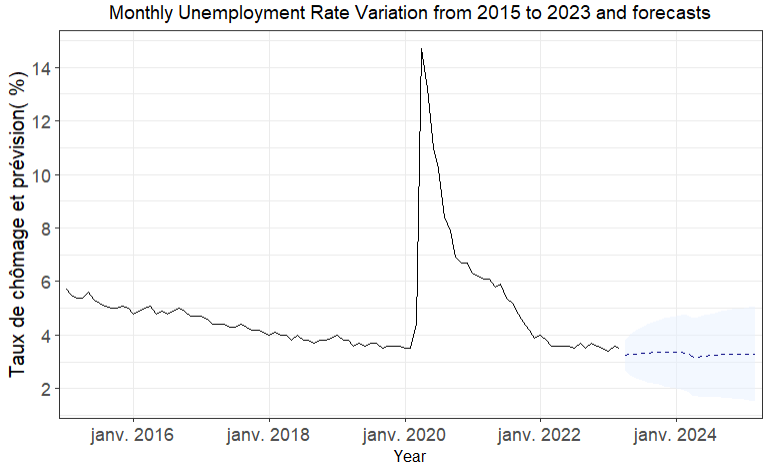

## 

### Introduction

The unemployment rate is a crucial economic indicator for assessing the dynamism of the labor market. There are various causes for a high unemployment rate, including cyclical contractions in the economy or structural frictions in job search, such as stringent labor codes. The evolution of the unemployment rate is therefore vital for political and economic institutions, particularly the state and central banks, as it helps them make informed decisions regarding financial and monetary policies.

The United States of America's unemployment rate is particularly interesting due to its status as one of the largest markets in the world with relatively weak regulatory measures. Consequently, it maintains a low structural unemployment rate, typically hovering around 4.5%, indicating near full employment. In contrast, countries like France, which rank high in job protection, have experienced a consistently higher structural unemployment rate of approximately 8% over several decades.

As part of our project, we aimed to model the unemployment rate to provide month-by-month forecasts for the upcoming years. Our dataset consists of a monthly time series spanning from 1948 to 2023, tracking the changes in the unemployment rate in the United States.

### A history of unemployment in the united states

The raw time series we have poses two obstacles to effectively modeling the unemployment rate.

The first obstacle is the lengthy duration of the series, spanning seventy-five years. From a macroeconomic perspective, attempting to model an indicator like unemployment over such a long period is irrelevant. Demographics, technological progress, productivity, and the global political and economic landscape have undergone significant transformations in less than a century, bearing little resemblance to what they were in 1948. Considering this reality, we have chosen to reduce the duration of the series by starting it in 1989. This year marks the fall of the Berlin Wall, symbolizing the collapse of the Soviet bloc and the end of the Cold War. It signifies the transition from a bipolar world to a relatively stable unipolar world, with the United States as the leading global power.

The second obstacle is related to the COVID-19 pandemic that struck the world in 2020. The lockdown measures implemented in response to this unprecedented health crisis resulted in a significant surge in the unemployment rate, soaring from around 3.5% in February 2020 to 14.7% in April 2022—an unprecedented level in the United States since the Great Depression. The rate gradually declined and returned to its pre-pandemic level by early 2022. Since this event was unforeseeable and beyond economic and financial considerations, we have chosen to disregard it. Consequently, the models we have developed are based on a truncated version of the time series, ending in December 2019.

However, the forecasts derived from the selected model will be performed on the 1989 series, encompassing the period up until the present, including the impact of the health crisis. Therefore, our analysis will be based on the monthly evolution of the unemployment rate over a thirty-year period, ranging from 1989 to 2019.

### Modeling unemployement: ARIMA, ARIMAX, LSTAR

We built three different models. Two of these models are linear – the ARIMA and ARIMAX models – while the third is nonlinear – the LSTAR model.
The idea was to compare these three models using several indicators and retain the one whose intra-project forecasts sample were the most relevant.
=== "ARIMA"
    The initial model used is the ARMA model (Autoregressive Moving Average). The concept behind this model is to represent the analyzed time series as a combination of its past random error values and terms, assuming linearity. However, since the series being analyzed is not stationary, the ARIMA model (Autoregressive Integrated Moving Average) is employed. The "I" in ARIMA stands for Integrated, indicating that the model considers the differences between observations in the time series rather than the raw values, allowing for the treatment of a non-stationary series.

    The selection of an ARIMA model is justified by the fact that the unemployment rate is typically highly correlated with its past values. If unemployment increases in March, it is highly probable that it will continue to increase in April of the same year, and vice versa. Based on this assumption, without incorporating any exogenous variables at this stage, we have modeled unemployment.
    
    In this case, the chosen ARIMA model is as follows: `ARIMA (1, 1, 3) (1, 0, 2)`. The Ljung-Box test yields a p-value of 0.71, well above the threshold α of 0.05. This indicates  that the null hypothesis is not rejected, meaning that the residuals of our model are independent and not autocorrelated, indicating good model quality.

    To evaluate the performance of our model, we have conducted within-sample predictions. We selected an arbitrary date, denoted as T*, which corresponds to December of the year  2014. This allows us to compare the model's predictions with the actual values. For this model and subsequent ones, we calculated the root-mean-square error (RMSE) for forecast horizons of h = 1 and h = 5, representing one month and five months into the future, respectively. Additionally, we computed the Theil U statistic for horizons of h = 1 and h = 4, ie one month and four months later. Its expression is as follows: U = $\frac{RMSE retained model}{RMSE naive model}$

    If U $\ge$ 1, the retained model is worse than the naive model – which simply repeats the last known value as a forecast. If U < 1, the retained model is more predictive than the naive model. For this first ARIMA model, the RMSEs obtained are 0.169 for h=1 and 0.157 for h=5; the U indicator of Theil is worth 1.694 for h = 1 and 0.548 for h = 4. This first ARIMA model does not seem too far from reality in terms of intra-sample forecasts and, according to the U of Theil, the ARIMA model is `more efficient` than the model naive at the horizon h = 4.
=== "ARIMAX"
    If we want to model unemployment in relation to its own past values, considering external factors can enhance the accuracy of our forecasts. This principle applies to the unemployment rate, which is entirely reliant on the economic circumstances of the particular country.The first economist to recognize the existence of a relationship between the unemployment rate and inflation rate was William Phillips, a New Zealand economist. The Phillips curve, named in his honor, was subsequently empirically verified by Paul Samuelson and Robert Solow in the 1960s.

    The underlying idea of this curve is that when the unemployment rate is low, wages tend to rise, resulting in increased production costs for companies. To compensate for these costs, firms increase the prices of the goods and services they sell, leading to higher inflation. Conversely, when the unemployment rate is high and jobs are scarce, wages tend to decrease, reducing production costs for firms. As a result, companies can keep prices low to attract consumers, which limits inflation.
    
    This negative relationship is evident in our data . For instance, during the 2008 subprime mortgage crisis, while unemployment surged to 10%, inflation plummeted to less than 1%. Subsequently, as inflation returned to its pre-crisis level, unemployment gradually declined. To account for this relationship, we constructed a model that incorporates the monthly changes in inflation, measured on a year-on-year basis, over the same period. This is where the ARIMAX model (AutoRegressive Integrated Moving Average with exogenous variables) comes into play. The ARIMAX model is an extension of the ARIMA model and allows for the modeling of short-term relationships between an endogenous variable and one or more exogenous variables. In this case, inflation serves as the exogenous variable.

    The selected ARIMAX model consists of the same orders as the ARIMA model: `ARIMAX(1, 1, 3)(1, 0, 2)`. The p-value obtained from the Ljung-Box test is 0.98, indicating that the null hypothesis is not rejected, and our model is considered relevant. For this ARIMAX model, the root mean square errors (RMSEs) obtained are 0.169 for h = 1 and 0.157 for h = 5. These values are very similar to those obtained from the ARIMA model without considering inflation. Theil's U statistic behaves similarly, with a value of 1.694 for h = 1 and 0.548 for h = 4. Therefore, despite incorporating inflation as an exogenous variable, this ARIMAX model appears to be largely `equivalent` to the ARIMA model.
    
=== "LSTAR"
    The LSTAR model (Logistic Smooth Transition AutoRegressive) is an econometric model that allows for the modeling of time series exhibiting different growth regimes. This model is particularly useful in capturing threshold phenomena, which are often observed in economic and financial data. A threshold phenomenon implies that the relationship between two variables is nonlinear and changes beyond a certain threshold.

    For instance, it is possible that the unemployment rate remains relatively stable below a specific threshold, such as 5%. However, beyond this threshold, it may suddenly escalate and become highly volatile. Linear models like ARMA are unable to capture such realities.

    In the case of the LSTAR model, the obtained root mean square errors (RMSEs) are 0.170 for h = 1 and 0.216 for h = 5. These values are higher compared to the ARIMA and ARIMAX models, indicating that this third model may be less efficient. Similarly, Theil's U statistic is 1.700 for h = 1 and 0.766 for h = 4, suggesting that this model performs `better` than the naive model at the h = 4 horizon but worse than the first two models we considered.

### Compare models
Here is a table summarizing the performance of each of the three models we have built: 

| Model  |       |ARIMA |       |          | ARIMAX |       |      |LSTAR   |      |
|--------|-------|------|-------|----------|--------|-------|------|--------|------|
|  h     | h = 1 | h = 4| h = 5 | h = 1    | h = 4  | h = 5 | h = 1| h = 4  | h = 5|
| RMSE   | 0.17  |   /  | 0.16  | 0.17     |    /   | 0.16  | 0.17 |   /    | 0.22 |
| U      | 1.69  | 0.55 |  /    | 1.69     | 0.55   |  /    | 1.70 | 0.77   |  /   |

To complete this comparison of the three models, we used the Diebold-Mariano test. The only requirement for using this test is that the models being compared are not nested, which is true in our case. The null hypothesis tested is that the difference in the loss functions associated with the compared models is statistically equal to zero. This means the models have equal predictive ability. In our case, the Diebold-Mariano tests performed did not allow us to distinguish between the models, since the p-values were far too high to reject the null hypothesis.

This confirms the proximity in announced performance of the models suggested by the very similar RMSE and Theil's U values. The Diebold-Mariano tests, with p-values much too high to reject the null hypothesis of equal predictive ability, did not separate our models.

### Forecast of the developement of the unemployment rate 
Finally, we estimated the evolution of unemployment over the next two years. It is important to keep in mind that current global economic conditions are strongly impacted by high inflation, which reached 6.6% in December 2022. This rise in inflation, primarily linked to the pandemic, would be the result of supply chain disruptions as well as massive monetary aid from governments and central banks in 2020 and 2021. The Russian invasion of Ukraine in February 2022 exacerbated this situation by pushing up global oil and gas prices.

Since nothing seems to separate our models in terms of raw performance, we made the choice, given the inflationary context described above, to use our ARIMAX model which precisely takes into account this parameter exogenous.
To forecast from this variable model exogenous, we have to make a hypothesis on the evolution of inflation itself. We choose to offer two
historically realistic scenarios:
— In the first case, possibly in reaction to the increase interest rates by the Federal Reserve, inflation falls and regains, in the space of 24 months, a level of 2%.
— In the second case, inflation in the United States stabilizes at its current level, around 6.5%: the world West is entering a prolonged period of inflation high, like the decade 1970-1980

=== "First scenario: rapid decline in inflation"
    In this first scenario, the future values of inflation provided to our ARIMAX model start from the last known value, i.e. about 6.5%, and converge in the space of two years towards 2%, i.e. the inflation rate generally targeted by most developed economies. This decrease inflation is plausible since desired by the Reserve federal governmen which, by raising its policy rates, seeks to reduce demand and therefore limit the current “overheating” economy. This scenario, desirable for the United States, is a priori the more likely according to financial analysts.
    
    In this first scenario, if inflation goes down, unemployment starts to rise again. The unemployment rate ends up stabilize from October 2024 around 6.5%. This rate is twice as high as today but still remains relatively low, even for the US economy. This estimate is consistent with the Phillips curve which announces a negative relationship between unemployment and inflation.
=== "Second scenario: continued high inflation"
    In this second scenario, inflation is flat at 6.5% for the next two years. This scenario is less desirable than the first given the unstructured nature of inflation. In this second scenario, strongly inflationary, unemployment remains very low, around by 3.5%. Again, this result is consistent with the Phillips curve.
    

### Conclusion and recommendation 
The two scenarios considered above correspond to economic realities that American policy makers must take into account to arbitrate.
The question can be posed in these terms: should we seek contain inflation at the cost of high unemployment or even, possibly a recession? If we assume that it priority must be given to curbing inflation, below which value would be considered reasonable? Public powers Americans prepared to deal with the rising unemployment rate? unemployment that would result?
Having said that, we must keep in mind that these models economic figures are only simplified representations of reality. In order to make appropriate decisions, institutions must also consider other factors external, whether political or sociological. Policy makers need to consider a more complete, taking into account the historical, cultural contexts and specific institutions in the United States.